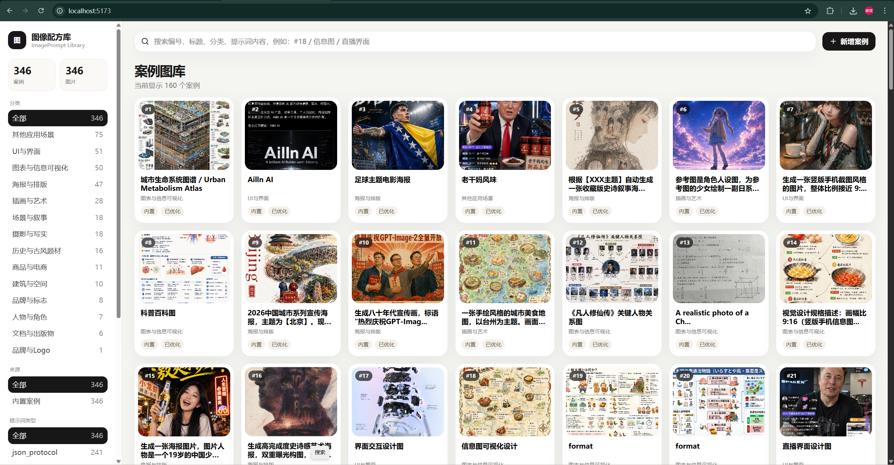

# 图像配方库 ImagePrompt Library



一个轻量的 **AI 图像提示词与样板图管理工具**。

第一版目标很克制：把内置案例图、展示提示词、填空模板、原始提示词管理好，支持搜索、筛选、大图查看、复制提示词、用户新增案例与多图上传。后续可以扩展连续页、项目包、AI 自动改写、生图接口和多模型适配。

## 为什么不叫 GPT-Image2 伴侣？

内部可以这么叫，但开源项目名使用 **ImagePrompt Library / 图像配方库**，避免直接借用第三方品牌作为产品主名，更适合公开发布和长期维护。

## 开源署名

本项目的内置案例数据整理自 `freestylefly/awesome-gpt-image-2`，原项目为 MIT License。详见：[`ATTRIBUTION.md`](./ATTRIBUTION.md)。

为了控制仓库体积，默认不附带 346 张案例图片。请从原项目复制 `data/images/case*.jpg` 到本项目的 `public/data/images/`。

## GitHub 发布

详见：[`PUBLISHING.md`](./PUBLISHING.md)。

## 当前功能

- 346 条内置案例清单导入
- 案例图库瀑布式卡片
- 编号、标题、分类、提示词内容搜索
- 分类、来源、语言、提示词类型筛选
- 案例详情页
  - 大图完整查看，不裁切
  - 多图胶片条
  - 展示说明
  - 填空模板
  - 原始提示词
  - 图片资产
  - 元信息
- 新增用户案例
- 一个案例支持上传多张样板图
- SQLite 数据库存储
- 本地 uploads 文件存储

## 技术栈

- 前端：Vite + React + TypeScript
- 后端：Express + TypeScript
- 数据库：SQLite / better-sqlite3
- 上传：multer
- 缩略图：sharp

## 启动

```bash
npm install
npm run dev
```

默认地址：

- 前端：http://localhost:5173
- 后端：http://localhost:3177

## 导入内置图片

项目已包含内置案例 JSON：

```txt
data/builtin/awesome_gpt_image_cases_v2_prompt_optimized_cn.json
```

但为了节流，仓库里默认不附带 346 张案例图片。你需要把原项目的图片复制到：

```txt
public/data/images/
```

例如：

```txt
public/data/images/case1.jpg
public/data/images/case2.jpg
...
public/data/images/case346.jpg
```

启动后会自动导入内置案例数据。  
如果你需要重置导入：

```bash
npm run seed -- --overwrite
```

## 数据结构

核心表：

- `cases`：案例主表
- `case_images`：图片资产，一个案例可多张图
- `prompt_versions`：提示词版本
- `tags` / `case_tags`：标签扩展

这版已经为后续连续页和项目包留好了空间。

## 后续扩展方向

- 模板变量表单生成
- 基于案例派生到“我的库”
- 连续页项目包
- AI 自动生成展示版和模板版
- 图片反推提示词
- 多模型提示词适配
- 一键导出提示词包

## 常见问题：Cannot GET /

如果你看到 `Cannot GET /`，通常是打开了后端地址。

开发模式下请打开：

```txt
http://localhost:5173
```

后端地址是：

```txt
http://localhost:3177
```

如果要让后端直接托管前端页面，请执行：

```bash
npm run build
npm start
```
